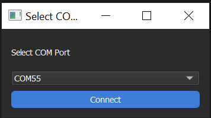
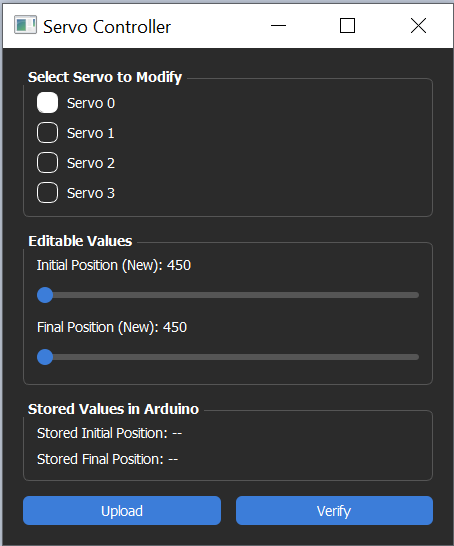

# Servo Controller GUI

[](https://www.python.org/) [](https://www.riverbankcomputing.com/software/pyqt/) [](https://platformio.org/) [](https://www.arduino.cc/)
A user-friendly PyQt5 application for controlling servo motors connected to an Arduino Leonardo board. This application allows you to select, configure, and control multiple servo motors. The servos position values are stored in the controller EEPROM memory.

---

## ⚡ Quick Start

> **📦 The application executable is located in:** `python_gui/dist/ServoController.exe`
>
> Simply double-click `ServoController.exe` to launch the application - no Python installation required!

---

## Getting Started

### Step 1: Launch the Application
1. Double-click the `ServoController.exe` file from the `python_gui/dist` folder to open the GUI.
2. The application displays available COM ports in the **Port Selection** dropdown
2. Click the **dropdown menu** to view all connected devices
3. Select the COM port where your Arduino Leonardo is connected



---

### Step 2: Configure Servo Motor

1. Use the **Servo Selection** radio buttons or dropdown to choose which servo (1-4) you want to control
2. **Using the Slider:** Drag the **Position Slider** to adjust the servo angle. The slider range is calibrated for our servo operation (450-1050 pulse width)
3. Click **Apply** to send the command



---

## Features

✅ Support for up to 4 servo motors   
✅ Manual setpoint value entry  
✅ Serial communication with controller  
✅ Auto-detection of available COM ports  
✅ Error handling and status feedback  

---

## Requirements

- **Hardware:** Arduino Leonardo with servo motors connected to digital pins
- **Software:** Windows OS (exe provided) or Python 3.8+ with PyQt5

---

## Hardware Setup & Arduino Configuration

### Arduino Leonardo Pin Configuration

The Arduino code uses the following pins to control up to 4 servo motors:

| Servo | PWM Output Pin | Control Signal Pin | Pulse Range |
|-------|----------------|-------------------|-------------|
| **Servo 0** | Pin 3 | Pin 2 | 450–1050 µs |
| **Servo 1** | Pin 5 | Pin 4 | 450–1050 µs |
| **Servo 2** | Pin 6 | Pin 7 | 450–1050 µs |
| **Servo 3** | Pin 9 | Pin 8 | 450–1050 µs |

### Wiring Servo Motors

1. **Power Supply:** Use an external 5V power supply (servos can draw significant current)
   - Connect positive rail to servo red wires
   - Connect negative/ground rail to servo brown wires

2. **Signal Connections:** Connect servo signal pins (orange wire) to the Arduino Leonardo:
   - **Servo 0 signal** → Arduino Pin 3
   - **Servo 1 signal** → Arduino Pin 5
   - **Servo 2 signal** → Arduino Pin 6
   - **Servo 3 signal** → Arduino Pin 9

3. **Ground Connection:** 
   - Connect the common ground between Arduino and external power supply
   - Do NOT power servos directly from Arduino (insufficient current)
---

## Troubleshooting

| Issue | Solution |
|-------|----------|
| **Port not appearing** | Ensure Arduino is connected via USB and drivers are installed |
| **Connection timeout** | Check that the correct port is selected and Arduino firmware is uploaded |
| **Servo not moving** | Verify servo is properly connected to Arduino and power supply is adequate |
| **Servos vibrating/humming** | Ensure power supply has adequate capacity (typically 2A+ for 4 servos)|
---

## Modifying the Arduino Firmware

If you want to modify the servo controller firmware and upload it to your Arduino Leonardo, use **PlatformIO**:

### Prerequisites

- Install [Visual Studio Code](https://code.visualstudio.com/)
- Install the **PlatformIO IDE** extension in VS Code

### Installing PlatformIO

1. Open VS Code
2. Go to **Extensions** (Ctrl+Shift+X)
3. Search for "PlatformIO IDE"
4. Click **Install**

### Building and Uploading Firmware

1. **Open the project folder** in VS Code (File → Open Folder → select the servo-controller folder)

2. **Modify the source code** 
    if desired, e.g., files in the `src/` folder (e.g., `servomotor.cpp`, `main.cpp`)

3. **Build the firmware:** 
    Click the **✓ (Build)** button in the PlatformIO toolbar at the bottom

4. **Upload to Arduino Leonardo:**
   Connect your Arduino Leonardo via USB, and click the **→ (Upload)** button in the PlatformIO toolbar

### Project Structure

```
servo-controller/
├── src/
│   ├── main.cpp              # Main program loop
│   ├── servomotor.cpp        # Servo control functions
│   ├── servomotor.h          # Servo pin definitions
│   ├── gui_interaction.cpp   # Serial communication with GUI
│   ├── gui_interaction.h
│   ├── memory_mgmt.cpp       # EEPROM storage functions
│   └── memory_mgmt.h
├── include/                  # Header files
├── lib/                      # External libraries
├── platformio.ini            # PlatformIO configuration
└── python_gui/               # Python GUI application
```

### Common Modifications

**Change servo output pins:**
- Edit `src/servomotor.h`
- Modify the `#define SERVO_OUTPUT_PIN_X` values (must be PWM-capable pins)

**Adjust pulse width range:**
- Edit `src/servomotor.h`
- Change `PULSE_MIN`, `PULSE_MAX`, or `PULSE_CENTER` values

**Add debug output:**
- Use `Serial.print()` or `Serial.println()` in your code
- View output via Serial Monitor in PlatformIO
- Debug print statements should be later deleted as it might interfere with the operation of the GUI.

### Troubleshooting Firmware Build

| Issue | Solution |
|-------|----------|
| **Upload fails** | Ensure Arduino is selected as board in `platformio.ini` and COM port is correct |
| **Compilation errors** | Check for syntax errors and ensure all libraries are installed |
| **Board not detected** | Install Leonardo USB drivers or restart VS Code |

---

## Building the GUI from Source

If you want to rebuild the Python executable:

```powershell
# Install PyInstaller
pip install pyinstaller

# Navigate to the python_gui folder
cd python_gui

# Create the executable
pyinstaller --onefile --windowed --name "ServoController" gui-servos.py

# The executable will be in the dist folder
```
